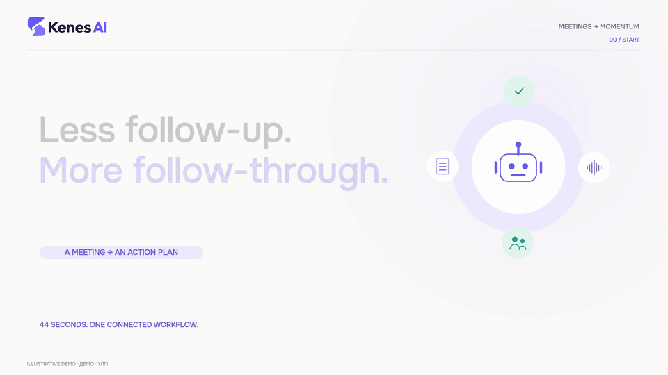
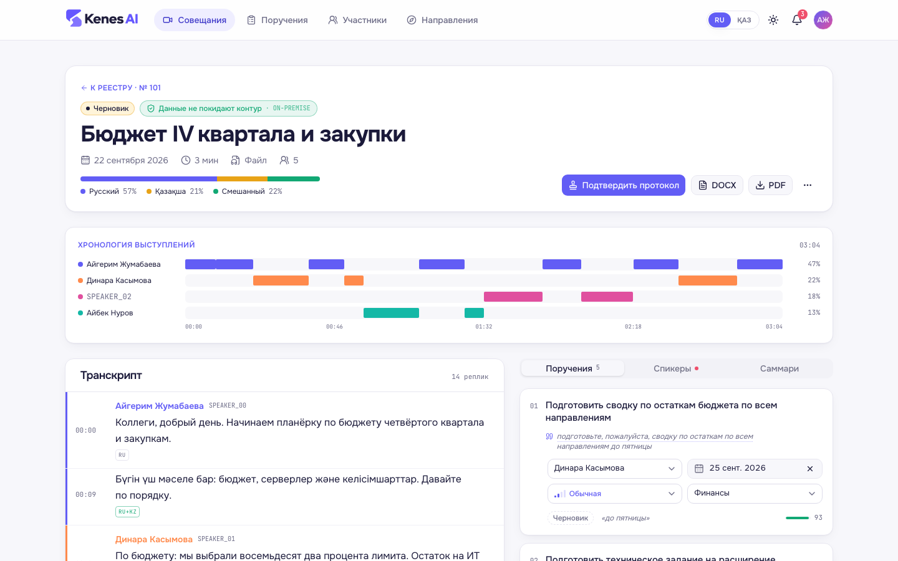
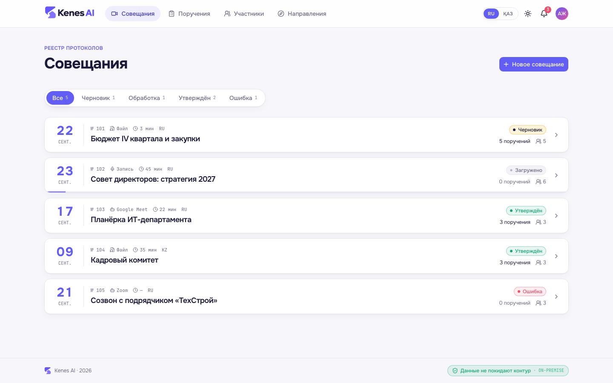
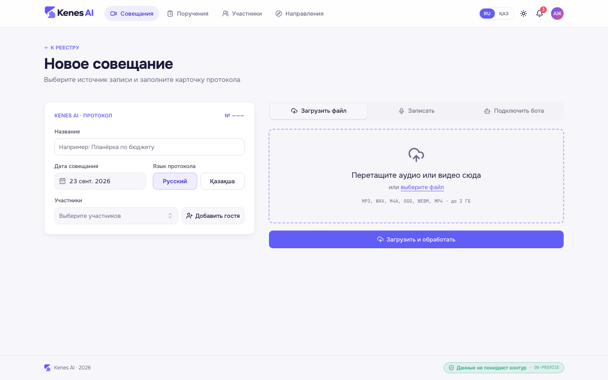
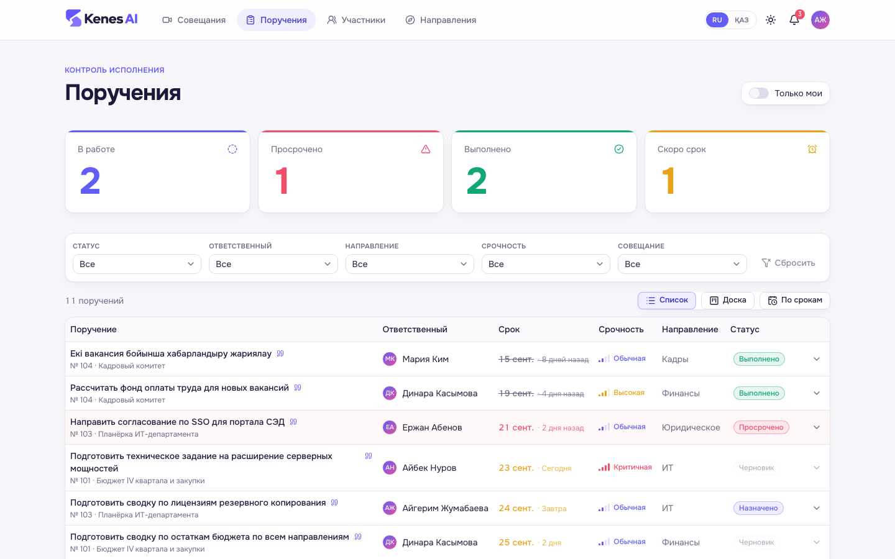
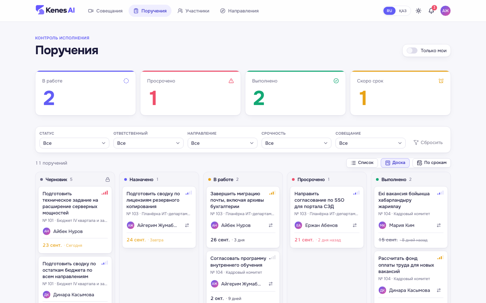
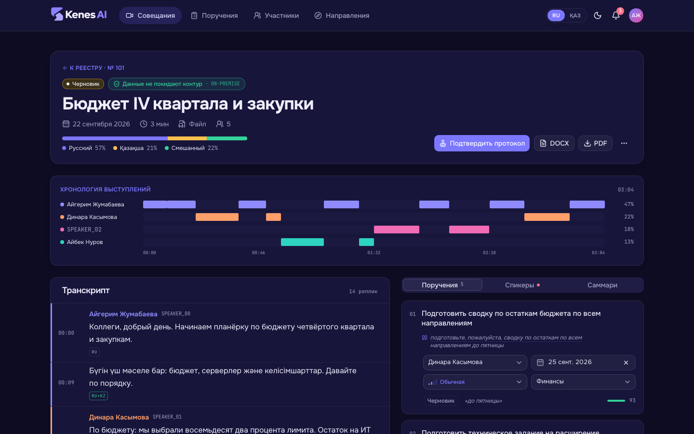
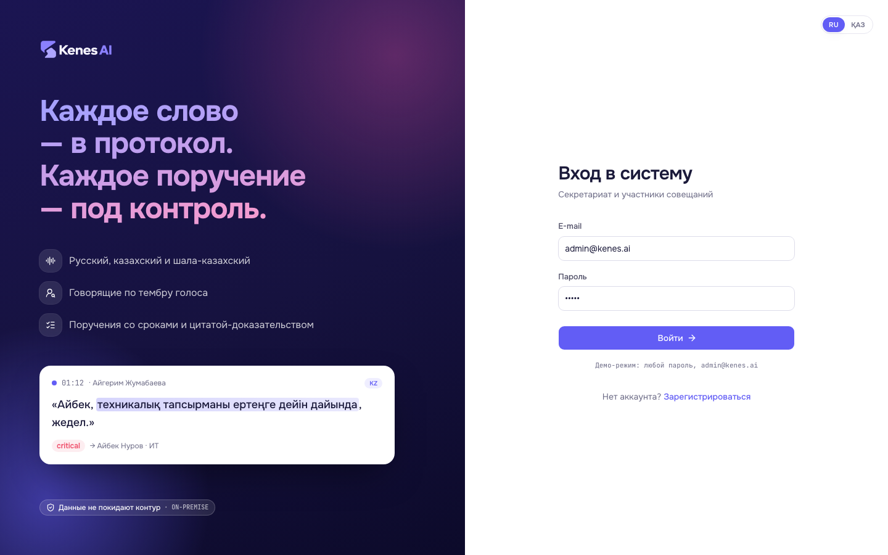

# Kenes AI: демонстрационные материалы

[Демо Видео](https://drive.google.com/file/d/1XTiGx9h5mcA_WB-fe_y8MCoQmDu9jzl7/view?usp=sharing) · [PDF](protocol.pdf) · [DOCX](protocol.docx) · [README проекта](../../README.md)

## Демо Видео



[Смотреть на Google Drive](https://drive.google.com/file/d/1XTiGx9h5mcA_WB-fe_y8MCoQmDu9jzl7/view?usp=sharing) · [Скачать MP4](../../demo/Kenes-AI-Demo-v2.mp4?raw=true): 44 секунды, 1920 × 1080. GIF содержит ролик целиком, 960 × 540, 10 кадров/с, без звука. Видео иллюстрирует сценарий продукта; ниже приведены записи настоящего интерфейса на демоданных.

## GIF интерфейса

[Галерея: все 13 пунктов чеклиста + 3 дополнительных сценария](checklist/README.md). Две обзорные GIF ниже объединяют основные действия.

Запись от 23 сентября 2026 года. Исходный frontend: ветка `develop`, коммит [`2b12ea09f288d567fa42489b4a3623f17ec1a7a0`](https://github.com/BAITC-Hacks/hack-66c85e8f-01husky/commit/2b12ea09f288d567fa42489b4a3623f17ec1a7a0). Интерфейс запущен через `pnpm mock`; данные взяты из [`frontend/mocks/seed.ts`](../../frontend/mocks/seed.ts). Встреча № 101: «Бюджет IV квартала и закупки», 22 сентября 2026 года.

| Материал | Размер и длительность | Содержание |
|---|---|---|
| [meeting-evidence.gif](meeting-evidence.gif) | 2,1 МиБ · 19,7 с | Обзор совещания, цитата Динары на русском, поручение Айбека на казахском, саммари |
| [protocol-review.gif](protocol-review.gif) | 1,4 МиБ · 18,8 с | Выбор Тимура Ахметова для несопоставленного поручения, диалог подтверждения, печать утверждения, уведомления |
| [meeting-evidence.png](meeting-evidence.png) | 1280 × 900 | Статичный кадр с казахской репликой и поручением Айбека |

GIF показывают взаимодействие с настоящими компонентами frontend. Состояние меняют встроенные mock-обработчики, данные сохраняются в localStorage. Backend, распознавание аудио и ML-модели в записи не участвуют; проценты уверенности и привязки спикеров заданы фикстурой. Уведомления также демонстрационные. Сцена экспорта в галерее показывает скачивание mock-файлов. Содержимое документа в роликах не выдаётся за результат реальной обработки.

### Повторить действия

На указанном коммите:

```bash
cd frontend
pnpm install --frozen-lockfile
pnpm mock
```

Открыть `http://localhost:3000/login?reset-mocks`, войти как `admin@kenes.ai` с любым паролем, затем перейти на `/meetings/101`.

- Для первой GIF: прокрутить к поручениям, нажать цитату сводки бюджета, затем цитату технического задания Айбека; открыть вкладку «Саммари».
- Для второй GIF: в третьем поручении выбрать Тимура Ахметова, вернуться к заголовку, подтвердить протокол в диалоге и открыть колокольчик уведомлений.

Снимали в Chromium через Playwright, светлая тема, окно 1280 × 900. При записи скрыта только служебная кнопка Next.js Dev Tools. Действия не ускорены, ожидание обработки не имитируется. PNG-кадры собраны в GIF через FFmpeg: 1120 × 788, до 10 кадров/с, палитра 256 цветов. Gifsicle объединяет одинаковые кадры с сохранением пауз; анимация зациклена.

## Статичные экраны

Веб-приложение на Next.js с интерфейсом на русском и казахском, светлой и тёмной темой. Скриншоты сняты в режиме `pnpm mock` на демонстрационных данных.



<sub><b>Карточка совещания.</b> Хронология выступлений, доля русской, казахской и смешанной речи, транскрипт по спикерам. Справа поручения: ответственный, срок, срочность, направление и цитата, из которой поручение извлечено.</sub>

<table>
<tr>
<td width="50%"><br><sub><b>Реестр протоколов.</b> Источник записи, длительность, язык, статус обработки.</sub></td>
<td width="50%"><br><sub><b>Новое совещание.</b> Загрузка файла, запись с микрофона или бот во встречу.</sub></td>
</tr>
<tr>
<td><br><sub><b>Контроль исполнения.</b> Счётчики, фильтры по ответственному, направлению, срочности.</sub></td>
<td><br><sub><b>Доска поручений.</b> От черновика до выполнения; просрочка подсвечена.</sub></td>
</tr>
<tr>
<td><br><sub><b>Тёмная тема.</b> Хронология выступлений и доля русского, казахского и смешанной речи.</sub></td>
<td><br><sub><b>Вход.</b> RU / ҚАЗ переключаются в один клик.</sub></td>
</tr>
</table>

## Образец экспортированного протокола

[Сценарий будущего видео](media-storyboard.md) содержит согласованный диалог про склад со смешением языков внутри реплик. Для него потребуется отдельный реальный прогон. Документы PDF/DOCX на этой странице относятся к прежней fake-фикстуре про склад и отличаются от совещания в GIF.

Это смоделированный разговор с вымышленными участниками. Содержание взято из `pipeline/pipeline/fake.py`, файлы сформированы штатным `backend/app/services/export.py`. Аудио и реальные модели при сборке образца не использовались. Метки времени и результаты привязки спикеров в фикстуре заданы заранее.

## Участники и дата

Дата встречи: **23 сентября 2026 года**. Серик ведёт совещание, Айбек отвечает за финансы, Дана за юридические вопросы. В PDF «конец следующей недели» соответствует воскресенью 4 октября; секретарь проверяет такую трактовку перед утверждением.

## Сценарий записи

Три человека могут прочитать этот разговор для проверки реального пайплайна. Перед записью уведомите участников о записи и транскрибации ИИ. Новая запись получит собственные таймкоды; сравнивайте смысл, спикеров и сроки. Этот файл содержит текст для записи, аудиофайл в набор не входит.

**Серик:** Коллеги, начинаем. Сегодня обсуждаем бюджет на четвёртый квартал и запуск нового склада.

**Дана:** Қаржы бойынша есеп дайын, бірақ бірнеше сұрақ бар. Смета әлі бекітілмеген.

**Серик:** Айбек, подготовь обновлённую смету по складу до пятницы. Керек болса, Данамен бірге отырыңдар.

**Айбек:** Жақсы, пятницаға дейін жасаймын. Данамен бүгін кездесемін.

**Серик:** Дана, ты согласуй с юристами договор аренды до конца следующей недели. Это срочно, без него не стартуем.

**Дана:** Түсінікті. Тағы бір мәселе: IT-бөлім жаңа қоймаға интернет тартуы керек, бұл айдың соңына дейін.

**Серик:** Тогда Айбек ещё передай айтишникам заявку на подключение склада, срок конец месяца. Все свободны.

## Проверка результата на реальной записи

- В смете ответственным указан Айбек, срок 25 сентября.
- «Данамен бүгін кездесемін» относится к Айбеку и дню встречи, 23 сентября.
- В договоре аренды ответственная Дана; срок допускает ручное уточнение секретарём.
- Заявку в ИТ передаёт Айбек до 30 сентября.
- Каждая цитата присутствует в исходной реплике; роль говорящего и роль исполнителя различаются.

Это ориентиры для проверки, а не измеренные показатели качества модели. В реплике Даны также есть поручение IT-отделу провести интернет. Текущая fake-фикстура возвращает четыре задачи и не заявляет полноту извлечения: при проверке реальной модели отдельно оцените задачу IT-отдела и её связь с заявкой Айбека.

## Пересобрать документы

Из корня репозитория, нужны uv и LibreOffice (`soffice` в PATH):

```bash
uv run --project backend python backend/scripts/build_demo_protocol.py
```

Скрипт перезаписывает `docs/demo/protocol.docx` и `docs/demo/protocol.pdf`. БД и ML-модели не нужны. Для обновления изображения в README дополнительно нужен Poppler:

```bash
pdftoppm -f 1 -singlefile -scale-to 1400 -png docs/demo/protocol.pdf docs/demo/protocol-preview
```

Проверьте обе страницы PDF: таблицу с четырьмя поручениями и приложение с русскими и казахскими репликами. После обновления fake-фикстуры сверяйте цитаты и даты в README с новым документом.
